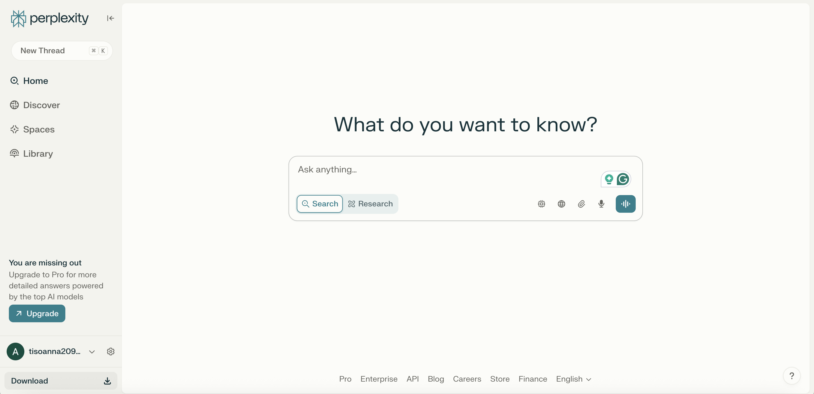
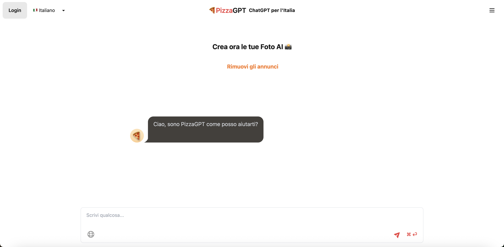
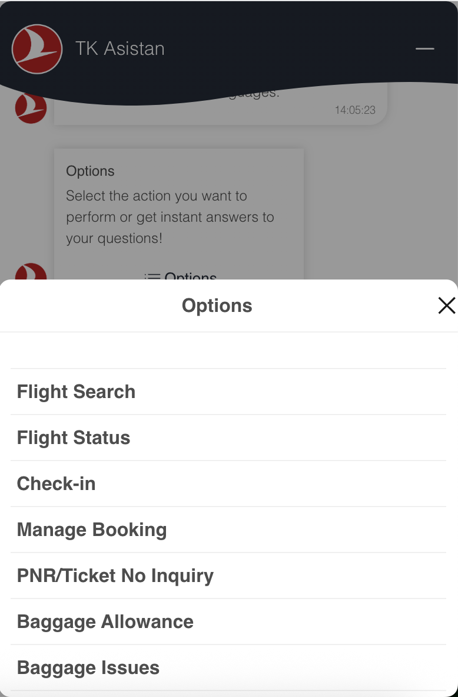

# Good and Bad Chatbots

## Table of Contents

1. [Introduction](#introduction)
2. [What are the features of a good chatbot?](#what-are-the-features-of-a-good-chatbot)
3. [Examples of good chatbots](#examples-of-good-chatbots)
    - [Natural-sounding example - Chat GPT](#natural-sounding-example---chat-gpt)
    - [Secure example - Claude](#secure-example---claude)
    - [Real-time information search example - Perplexity](#real-time-information-search-example---perplexity)
    - [Regulation-compliant example - PizzaGPT](#language-specific-example---pizzagpt)
4. [What makes a chatbot bad?](#what-makes-a-chatbot-bad)
5. [Examples of bad chatbots](#examples-of-bad-chatbots)
    - [Offensive example - Tay by Microsoft](#offensive-example---tay-by-microsoft)
    - [Frustrating example - Poncho](#frustrating-example---poncho)
    - [Non-conversational example - TK Assistant](#non-conversational-example---tk-assistant)
6. [References](#references)

## Introduction

A chatbot is a **digital agent** that can interact with a user through **natural text**. The chatbot takes as input a prompt from the user and outputs a response based on the prompt. The main uses of chatbots are customer service and virtual assistants.

> Chatbots represent a new trend in how people access information, make decisions, and communicate.
>
> — Christie Pitts (Verizon Ventures)

You can watch this YouTube video for further information about chatbots: [What is a Chatbot?](https://www.youtube.com/watch?v=o9-ObGgfpEk&ab_channel=IBMTechnology)

## What are the features of a good chatbot?

According to the [resources](#references) I read, a *good* chatbot should exhibit most of these characteristics:

1. 🧠 **Memory**: It should remember information provided previously in the chat to respond in a consistent and coherent manner.
2. 🔐 **Security**: It should handle user information responsibly to preserve the customer's privacy.
3. 💫 **Flexibility**: It should be able to adapt its style and responses based on the user's prompt and needs.
4. 💬 **Conversational ability**: It should output human-like responses that sound natural, smooth, and engaging.
5. ✅ **Accuracy**: The responses of the chatbot should be precise and correct, without hallucinations or false information.

These qualities are usually achieved through **artificial intelligence**, in particular large language models.

## Examples of good chatbots

### Natural-sounding example - [Chat GPT](https://chatgpt.com/)

- Understands the context and nuances of user input.
- Allows the user to personalize the chat by specifying the preferred tone and providing any information that Chat GPT should remember.
- Fluent in multiple languages and sounds natural.

### Secure example - [Claude](https://claude.ai/new)

- Focuses on user security and privacy.
- Monitors its own behavior to avoid harmful and dangerous responses.
- Provides human-like responses and understands complex user prompts.

### Real-time information search example - [Perplexity](https://www.perplexity.ai/)

- Enhanced deep research feature with access to real-time information.
- High accuracy in the responses, and it cites the sources so the user can double-check.

### Regulation-compliant example - [PizzaGPT](https://www.pizzagpt.it/)

- When ChatGPT was banned in Italy due to privacy concerns, this chatbot was created. It avoids storing user data and thus complies with Italian law.
- Based on GPT 3.5, it allows a smooth and natural conversation flow in different languages, including Italian.
- Created a sense of identity for Italian users, which allowed it to remain popular for a while even after ChatGPT was reintroduced in Italy.

## What makes a chatbot bad?

A chatbot is *bad* because it exhibits one or more of the following characteristics:

1. ❌ **Unreliability**: It is not transparent about its capabilities and provides wrong or inaccurate information, misleading the users.
2. 🤖 **Rigid and unnatural conversation**: It lacks adaptability to the user's style and tone, sounds robotic and unnatural, and makes the conversation awkward and uncomfortable instead of smooth and engaging.
3. 😣 **Frustrating**: It does not understand user input well and provides answers that are irrelevant or unrelated to the user's requests, sometimes sounding nonsensical.
4. 📉 **No added value**: Provides shallow or obvious information, which is not helpful to the user.
5. 🤬 **Offensive behavior**: It produces offensive or harmful responses, resulting in AI misuse and potentially dangerous content.
6. ❓ **Short memory**: Does not remember previous questions and answers, leading to repetitions and contradictions in the conversation.
7. ⚠️ **Privacy issues**: It does not handle sensitive data properly, breaching user trust and regulations.

## Examples of bad chatbots

### Offensive example - [Tay by Microsoft](https://en.wikipedia.org/wiki/Tay_(chatbot))

- Twitter chatbot designed to learn how to interact with humans on the platform but quickly started to output racist and offensive text.
- When the training data is not appropriately filtered, the chatbot will have biases and will likely produce harmful responses.

### Frustrating example - [Poncho](https://github.com/jrnnynrlson/poncho)

- Only allows the user to ask specific questions and often does not understand the user's request properly, sounding unnatural and robotic.
- Responds with inaccurate or wrong information.
- Does not bring much value or new information to the user and causes frustration due to the difficult interaction.

### Non-conversational example - [TK Assistant](https://www.turkishairlines.com/en-it/any-questions/get-in-touch/)

- Structured as a menu-based chatbot, it does not allow the user to type input and it barely feels like a conversation.
- Does not add much value as the user still needs to navigate the options autonomously, and the chatbot is not providing additional help compared to a normal webpage.
- Can feel limiting and frustrating for the user.

## References

Articles:

- [Wikipedia - Chatbots](https://en.wikipedia.org/wiki/Chatbot)
- [The best AI chatbots of 2025](https://www.zdnet.com/article/best-ai-chatbot/)
- [Important characteristics of a good chatbot](https://www.quora.com/unanswered/What-are-some-important-characteristics-of-a-good-chatbot-for-customer-service-besides-natural-language-processing-and-machine-learning)
- [12 famous AI disasters](https://www.cio.com/article/190888/5-famous-analytics-and-ai-disasters.html)
- [Top 10 chatbot fails and how to avoid them](https://www.comm100.com/blog/top-10-chatbot-fails-and-how-to-avoid-them.html)
- [Wikipedia - Tay (chatbot)](https://en.wikipedia.org/wiki/Tay_(chatbot))
- [PizzaGPT takes over Italy](https://www.toolify.ai/gpts/pizzagpt-takes-over-italy-the-viral-rise-of-chatgpts-successor-138641)

Videos:

- [What is a Chatbot?](https://www.youtube.com/watch?v=o9-ObGgfpEk&ab_channel=IBMTechnology)

Chatbots:

- [Chat GPT](https://chatgpt.com/)
- [Claude](https://claude.ai/new)
- [PizzaGPT](https://www.pizzagpt.it/)
- [Perplexity](https://www.perplexity.ai/)
- [Poncho](https://github.com/jrnnynrlson/poncho)
- [TK Assistant](https://www.turkishairlines.com/en-it/any-questions/get-in-touch/)
