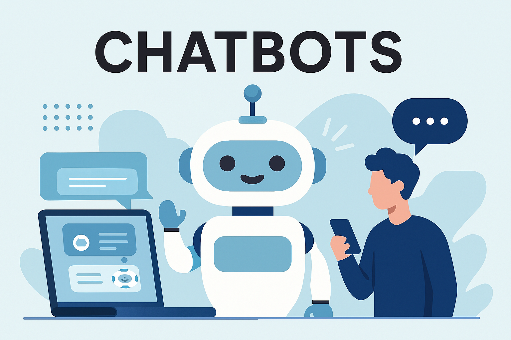
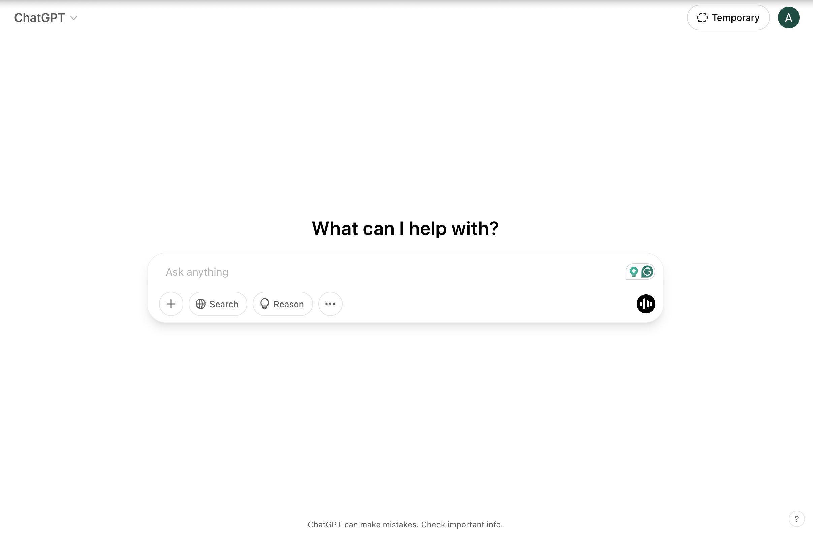
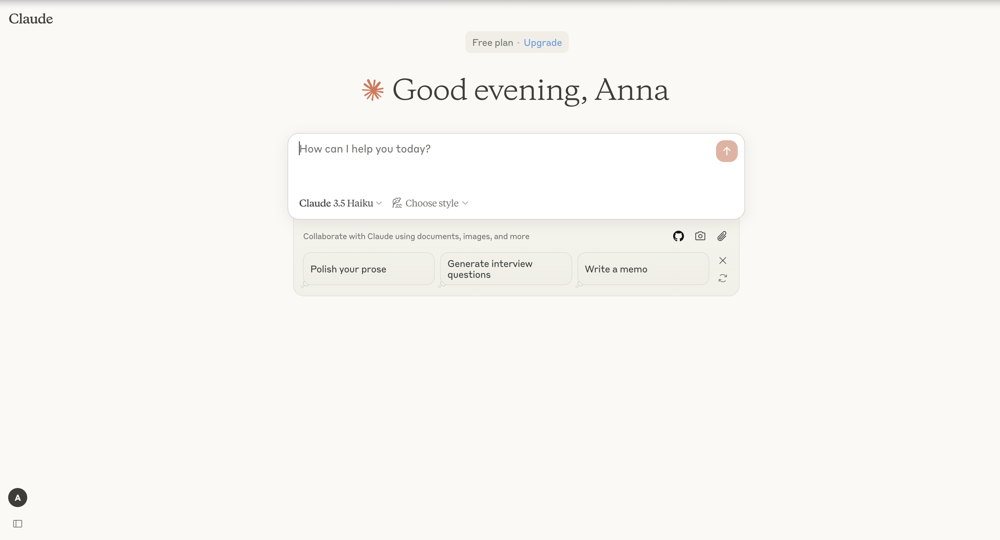

# Good and bad chatbots

## Table of Contents

1. [Introduction](#introduction)
2. [What are the features of a good chatbot?](#what-are-the-features-of-a-good-chatbot)
3. [Examples of good chatbots](#examples-of-good-chatbots)
    - [Natural-sounding chatbot - Chat GPT](#natural-sounding-chatbot---chat-gpt)
    - [Secure chatbots - Claude](#secure-chatbots---claude)
4. [Examples of bad chatbots](#examples-of-bad-chatbots)
    - [Offensive chatbots - Tay by Microsoft](#offensive-chatbots---tay-by-microsoft)
    - [Frustrating chatbots - Poncho](#frustrating-chatbots---poncho)
5. [References](#references)

## Introduction

A chatbot is a **digital agent** that can interact with a user through **natural text**. The chatbot takes as input a prompt from the user and outputs a response based on the prompt. The main uses of chatbots are customer service and virtual assistants.

> Chatbots represent a new trend in how people access information, make decisions, and communicate.
>
> — Christie Pitts (Verizon Ventures)

You can have a look at this YouTube video for further information about chatbots: [What is a chatbot? Types of chatbots & how they work](https://www.youtube.com/watch?v=mSY6JrJZ4aw&ab_channel=Zendesk)

## What are the features of a good chatbot?

When we talk about a *good* chatbot, it should present most of these characteristics:

1. **Memory**: It should remember information provided previously in the chat to respond in a consistent and coherent manner.
2. **Security**: It should handle user information in a responsible way to preserve the customers' privacy.
3. **Flexibility**: It should be able to adapt its style and responses based on the user's prompt and needs.
4. **Conversational ability**: It should output human-like responses that sound natural, smooth, and engaging.
5. **Accuracy**: The responses of the chatbot should be precise and correct, without hallucinations or false information.

These qualities are usually achieved through **artificial intelligence**, in particular large language models.

## Examples of good chatbots

### Natural-sounding chatbot - Chat GPT

- Understands context and nuances of user input.
- Allows the user to personalize the chat by specifying the preferred tone and providing any information that Chat GPT should remember.
- Fluent in multiple languages and sounds natural.

### Secure chatbots - Claude

- Focuses on user's security and privacy.
- Monitors its own behavior to avoid harmful and dangerous responses.
- Provides human-like responses and understands complex user prompts.

## Examples of bad chatbots

### Offensive chatbots - Tay by Microsoft

- Twitter chatbot designed to learn how to interact with humans on the platform but quickly started to output racist and offensive text.
- When the training data is not appropriately filtered, the chatbot will have biases and will likely produce harmful responses.

### Frustrating chatbots - Poncho

- Only allow the user to ask specific questions and often does not understand properly the user's request, sounding unnatural and robotic.
- Responds with inaccurate or wrong information.
- Does not bring much value or new information to the user and causes frustration due to the difficult interaction.

## References

- [Wikipedia - Chatbots](https://en.wikipedia.org/wiki/Chatbot)
- [The best AI chatbots of 2025](https://www.zdnet.com/article/best-ai-chatbot/)
- [12 famours AI disasters](https://www.cio.com/article/190888/5-famous-analytics-and-ai-disasters.html)
- [What is a chatbot? Types of chatbots & how they work](https://www.youtube.com/watch?v=mSY6JrJZ4aw&ab_channel=Zendesk)
